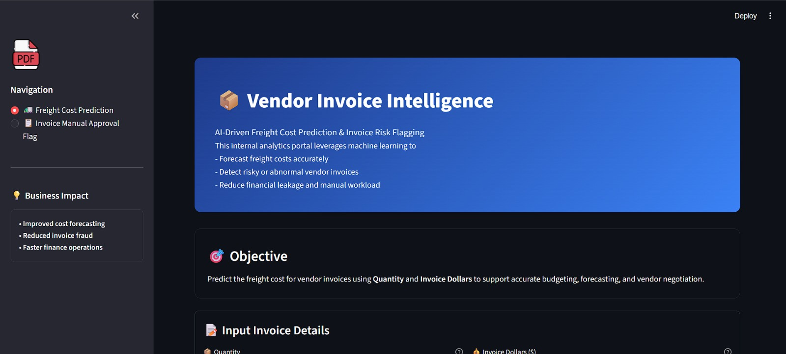
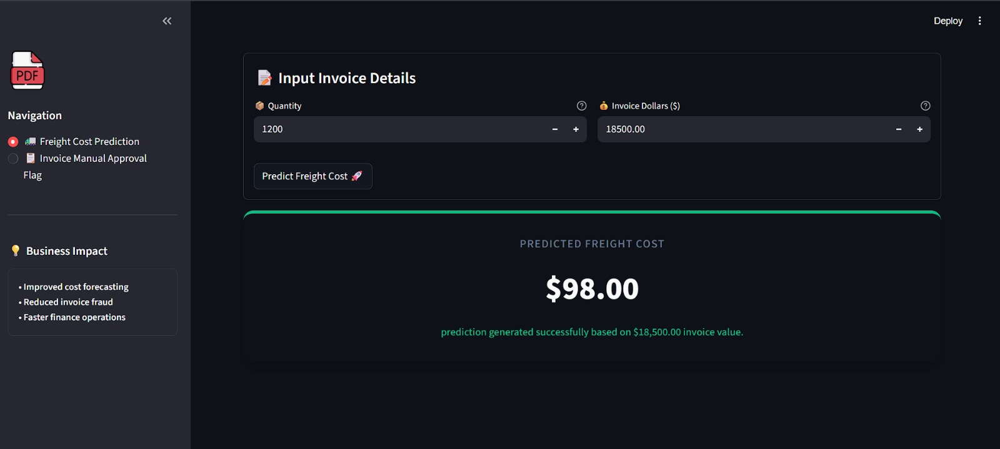
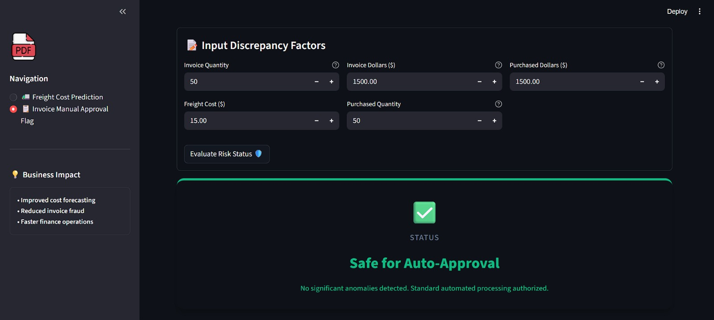

# Vendor Invoice Intelligence System
**Freight Cost Prediction & Invoice Risk Flagging**

## Demo
Here is a quick look at the Vendor Invoice Intelligence Portal:






## Table of Contents
* [Project Overview](#project-overview)
* [Business Objectives](#business-objectives)
* [Data Sources](#data-sources)
* [Models Used](#models-used)
* [Application](#application)
* [Project Structure](#project-structure)
* [How to Run This Project](#how-to-run-this-project)

---

## Project Overview

This project implements an **end-to-end machine learning system** designed to support finance teams by:

1. **Predicting expected freight cost** for vendor invoices.
2. **Flagging high-risk invoices** that require manual review due to abnormal cost, freight, or operational patterns.

---

## Business Objectives
- **Improved cost forecasting**: Estimate freight costs systematically to assist in accounting calculations based on expected variables.
- **Reduced invoice fraud and anomalies**: Filter out riskier vendor invoices to flag them for appropriate security assessment.
- **Faster finance operations**: Accelerate the operational review process by intelligently automating routine vendor invoice evaluations avoiding manual bottlenecks.

---

## Data Sources
The primary data is retrieved seamlessly from an internal SQLite Database `inventory.db` working in harmony alongside the `data/` data store directory housing CSV snapshots. The tables contain features evaluating invoices, purchase quantities, equivalent item dollars, and historical freight information.

---

## Models Used

1. **Freight Cost Prediction**: 
   - A high-performing structured Regression model trained to predict linear relationships connecting core variables like `Dollars` to eventual continuous freight values.
2. **Invoice Manual Approval Flagging**: 
   - Uses a configured automated `RandomForestClassifier` acting within a strict cross-validated `GridSearchCV` machine learning pipeline (with imputation and scaling safeguards).
   - Trained across multiple internal metrics resolving discrepancies intelligently between expected line items and claimed vendor costs to ensure reliable classification flags.

---

## Application
We built an interactive, simple-to-use application with `Streamlit`. The platform features dynamic native CSS, clean inputs, loading animations and status indicator cards designed specially for enterprise users and analysts without coding backgrounds. 

---

## Project Structure
```text
📦 Invoice_ML_project
 ┣ 📂 Image/                       # UI application demo screenshots
 ┣ 📂 data/                        # Contains raw datasets and .csv files
 ┣ 📂 freight_cost_prediction/     # Scripts for logic, preprocessing, and model training (Regression)
 ┣ 📂 inference/                   # Final runtime inference scripts returning predicted logic
 ┣ 📂 invoice_flagging/            # Scripts for creating invoice assessment logic (Classification)
 ┣ 📂 models/                      # Stored architecture `.pkl` artifacts of generated models
 ┣ 📜 app.py                       # The interactive Streamlit analytics Web Application code
 ┣ 📜 inventory.db                 # Database consisting of the core vendor/purchase tables
 ┗ 📜 readme.md                    # System documentation
```

---

## How to Run This Project

1. **Install Virtual Environment and Dependencies**
   Ensure you have all necessary Python libraries installed within your workspace:
   ```bash
   pip install pandas scikit-learn joblib streamlit plotly
   ```

2. **Run the Models Locally**
   **(Optional)** You can review or recreate model states locally by navigating to your internal architecture modules and executing their main training modules.
   ```bash
   python freight_cost_prediction/train.py
   python invoice_flagging/train.py
   ```

3. **Run the Streamlit Application**
   You can instantiate and serve the frontend intelligence portal safely by running the following application host command:
   ```bash
   python -m streamlit run app.py
   ```
   Navigate your connected browser to `http://localhost:8501`.
